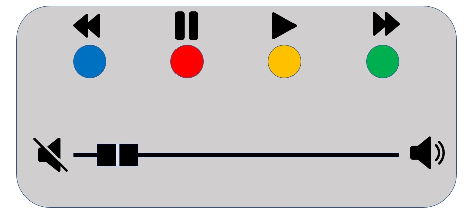

# Projeto Embarcados

Desenvolvendo um controle remoto.

## Entrega 1

### Integrantes

- Felipe Trintim
- Thomas Chabro

### Ideia

A ideia do projeto consiste na confecção de um controle remoto Bluetooth controlado por uma placa SAME70-XPLD para controlar o Spotify. Criaremos um dispositivo que irá se comunicar com um dispositivo móvel via Bluetooth para controlar a reprodução de músicas no aplicativo.

O controle, por sua vez, será constituído de 4 controles: "parar", "tocar", "avançar" e "voltar". Além disso, junto ao dispositivo criado pelo grupo, haverá um meio de controle do volume de reprodução, que será feito por meio de um potenciômetro.

Para isso, utilizaremos, além do potenciômetro, a placa SAME70-XLPD, módulo externo bluetooth HC-05 e outros componentes eletrônicos necessários.

### Nome

O nome do controle será "Spot-Click".

### Usuários

Entre os possíveis usuários do controle proposto, estão:

- Pessoas que ouvem música em casa em algum outro dispositivo de speaker. Enquanto seus celulares carregam ou estão em outro cômodo, elas podem controlar a reprodução de músicas do aplicativo pelo controle.

- Pessoas que dirigem diariamente e costumam ouvir música enquanto dirigem, porém não possuem nenhum controle multimídia no carro. Com o controle proposto, elas podem controlar a reprodução de músicas do aplicativo pelo controle, sem precisar abrir o celular, então correndo menos riscos de acidentes.

### Software/Jogo

Nosso controle irá controlar o Spotify, um aplicativo de reprodução de músicas.

### Jornada do usuários (3 pts)

Usuário 1:

Pedro é um jovem de 20 anos que adora ouvir música em casa e com os amigos. Além disso, por sua idade e proximidade com os amigos, costuma frequentemente receber grupos em sua casa. Esta recepção, para Pedro, é sempre um momento de descontração e de boa música, onde ele se preocupa em criar um ambiente agradável para seus amigos.

Quando recebe seus amigos em casa para uma festa, costuma utilizar o Spotify para reproduzir músicas. Entretanto, muitas vezes, seu celular está carregando na sala ou longe dele, fazendo com que Pedro necessite constantemente se levantar e ir até a tomada para realizar qualquer controle relacionado à música, seja ele para pausar, avançar, voltar a música ou até mesmo ajustar o volume.

A partir do momento onde Pedro conheceu o Spot-Click, tudo mudou. Agora, ele pode controlar a reprodução de músicas do aplicativo pelo controle, sem precisar se levantar da cadeira. Além disso, não precisa nem mesmo se preocupar com onde deixou o celular. Da mesa da sala, ele consegue manipular tudo e criar o melhor clima para aproveitar o tempo com seus amigos.

Usuário 2:

Joana é uma mulher de 37 anos, que trabalha como motorista de aplicativo. Por sua profissão e pelos sistemas de avaliação dos aplicativos parceiros, a experiência dos passageiros em sua corrida é muito importante para sua avaliação e consequentemente, para sua renda. Por isso, ela sempre se preocupa em criar um ambiente agradável para seus passageiros.

Entretanto, pelos altos preços atuais, seu carro não possui nenhum tipo de controle multimídia, como um display, onde ela possa reproduzir suas próprias músicas e controlá-las sem correr o risco de se distrair no trânsito ou tomar uma multa.

Porém, tudo ficou muito mais fácil quando ela viu um anúncio e comprou seu Spot-Click. Agora, ela pode controlar a reprodução de músicas do Spotify pelo controle, sem precisar se preocupar com qualquer distração envolvendo o celular, que precisa desbloquear, abrir o aplicativo, etc. Agora, ela pode controlar tudo pelo controle, enquanto dirige, e criar o melhor clima para seus passageiros.

### Comandos/ Feedbacks (2 pts)

- Pausar música
- Tocar música
- Avançar música
- Voltar música
- Ajustar volume

### In/OUT (3 pts)

- Pausar música: push botão vermelho
- Tocar música: push botão verde
- Avançar música: push botão amarelo
- Voltar música: push botão azul
- Ajustar volume: potenciômetro

### Design (2 pts)

